## Table of contents
<!-- TOC depthFrom:1 depthTo:6 withLinks:1 updateOnSave:1 orderedList:0 -->

	- [Table of contents](#table-of-contents)
	- [Synopsis](#synopsis)
	- [Pipeline](#pipeline)
		- [Color Selection](#color-selection)
		- [Canny Edge Detection](#canny-edge-detection)
		- [Region of Interest Selection](#region-of-interest-selection)
		- [Probabilistics Houg Transform to detect lines](#probabilistics-houg-transform-to-detect-lines)
		- [Extrapolate line segments (Improvement to  draw_line())](#extrapolate-line-segments-improvement-to-drawline)
	- [Results](#results)
		- [Pictures/Images](#picturesimages)
		- [Videos](#videos)
	- [shortcomings](#shortcomings)
	- [Improvements](#improvements)

<!-- /TOC -->
## Synopsis

When we drive, we use our eyes to decide where to go. The lines on the road that show us where the lanes are act as our constant reference for where to steer the vehicle. Naturally, one of the first things we would like to do in developing a self-driving car is to automatically detect lane lines using an algorithm.

A lane detection system assists the driver travel by automatically recognizing  painted lanes on the road.
In this project I develop a pipeline to  detect lane lines in images and videos using Python and OpenCV. OpenCV means "Open-Source Computer Vision", which is a package that has many useful tools for analyzing images. The package Moviepy helps analyze the video snippets.

Two file are submitted for this project: a file containing project **[code](./P1.ipynb)** and this file containing a brief write up explaining the solution.

The project requirements can be found [here](https://review.udacity.com/#!/rubrics/322/view) . Find below an example of expected results :

 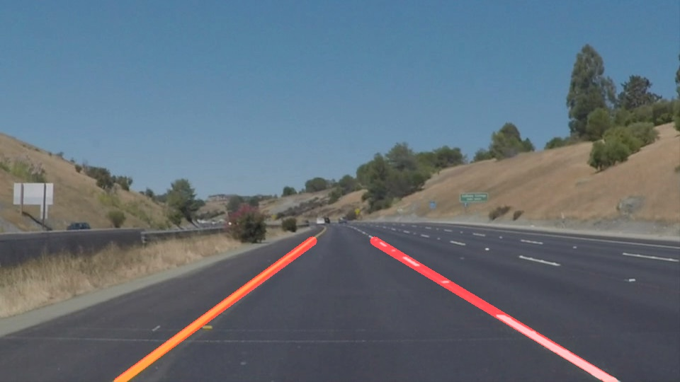

## Pipeline

The purpose of the pipeline is to compose several different operations together, apply them to images or video frames, and produce  annotated images/videos that show where  lanes are on a road.

My pipeline consists of the following steps:

* Color Selection
* Canny edge detection
* Region of Interest
* Apply Probabilistic  Hough transform to find line segments
* Extrapolate the lane from the line segments provided by the Hough transform

### Color Selection
The images are loaded in RGB color space.  The images are converted from the RGB color space to HSV color space. HSV color space is more suitable for color selection because road lanes can sometimes be overshadowed or occluded. HSV color space selection help overcome those challenges.Only the yellow and white colors are selected in the images or video frames.
First, I applied a color filter to suppress non-yellow. Then the  non-white colors are filtered out. The pixels that were within the threshold masks have been retained, and pixels beyond the threshold masks have been blacked out. Results are show below for solidYellowCurve2.jpg:

* White filtering mask

 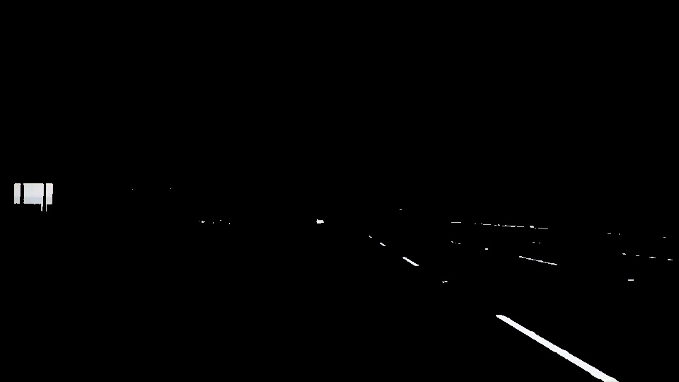

* Yellow fitering mask

 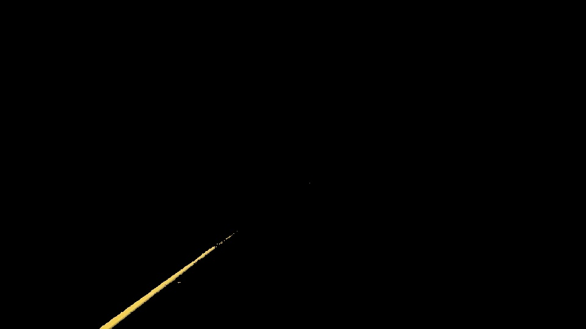

* White + Yellow filtering mask

 

### Canny Edge Detection

Before running the Canny detection, I converted the hsv image into grayscaled to facilitate edges detection.Then I applied  Gaussian smoothing which is essentially a way of suppressing noise on the grayscaled image. Results of the 3 steps are shown below for solidYellowCurve2.jpg.

* Gray Scaled conversion to facilitate edge detection:

 

* Gaussian Smoothing for noise suppression

 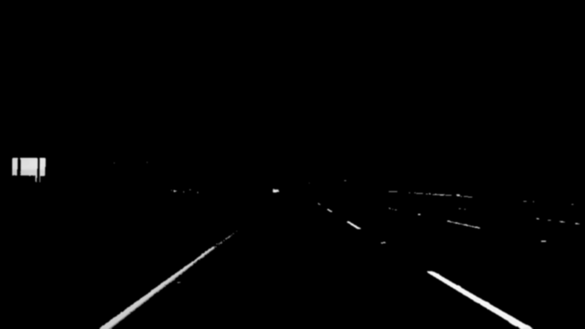

* Canny Edge detection results

 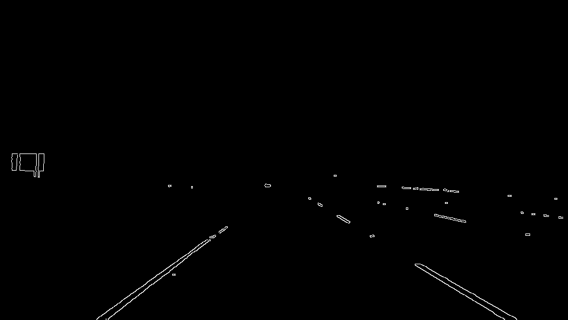

### Region of Interest Selection

I defined a left and right trapezoidal Region Of Interest (ROI) based on the image size. Since  the front facing cameras position are fixed, we supposed here that the lane lines will always appear in the same region of the image. See selected ROI below for solidYellowCurve2.jpg.

 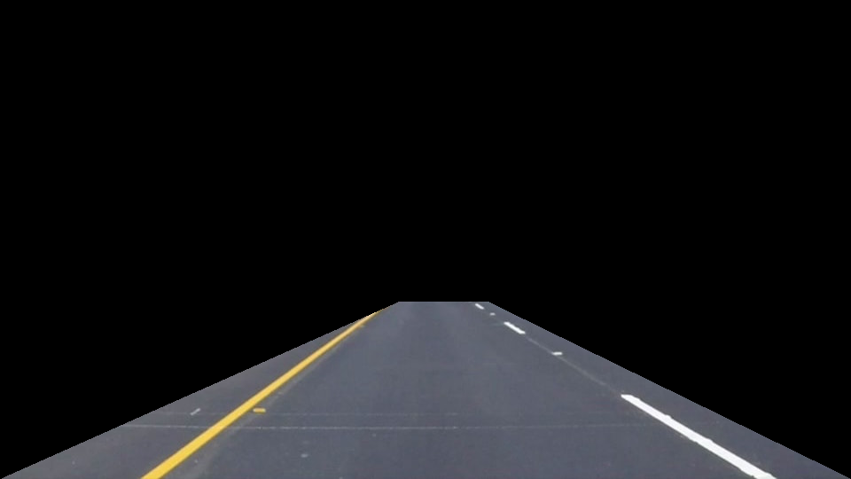

### Probabilistics Houg Transform to detect lines

The Hough transform is used to detect lines segment in the images. For this project I used the probabilitic hough transform. It gives as output the extremes of the detected lines (x0, y0, x1, y1). Because it is difficult to detect straight lines which are part of a curve because they are very very small. For detecting such lines it is important to properly set all the parameters of Hough transform. Two of most important parameters are: Hough votes and maximum distance between points which are to be joined to make a line. Both parameters are set at their minimum value.  A lot of time was spent tweaking those  parameters.

 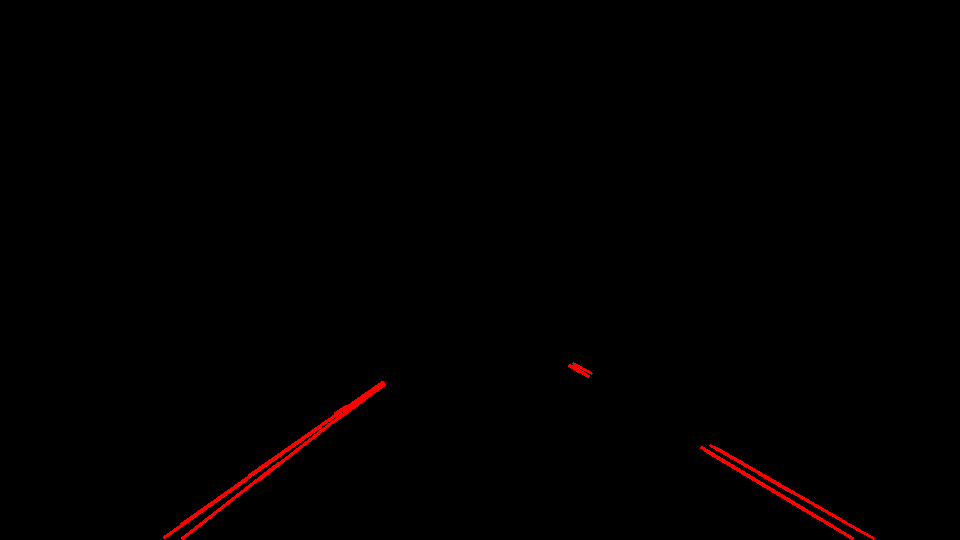

### Extrapolate line segments (Improvement to  draw_line())
Now I need to average/extrapolate the result of the Hough transform and draw the two lines onto the image. I used the function cv2.fitLine, after having separated the points from the Hough tranform results into two groups. Negative slopes for the left lines points are collected in one group and positive slopes for the right line points are gathered in the second group. My approach also keeps track of the previous frame during video processing to correct for video jitter issues. This operation is capture in the function **extrapolate_lane** as part of the improvement of the function **draw_lines()**.

My approach was based on this article from  **[Medium](https://medium.com/@esmat.anis/robust-extrapolation-of-lines-in-video-using-linear-hough-transform-edd39d642ddf)**

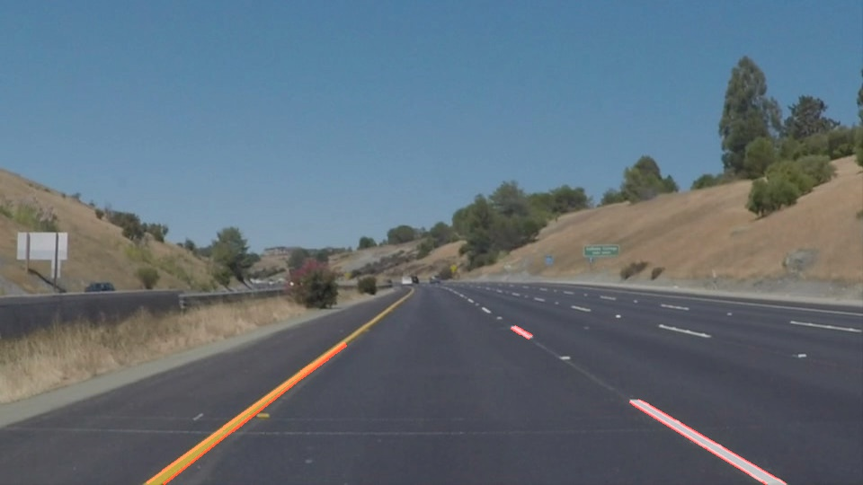 

## Results

Here are sample results

### Pictures/Images

* image 1:

 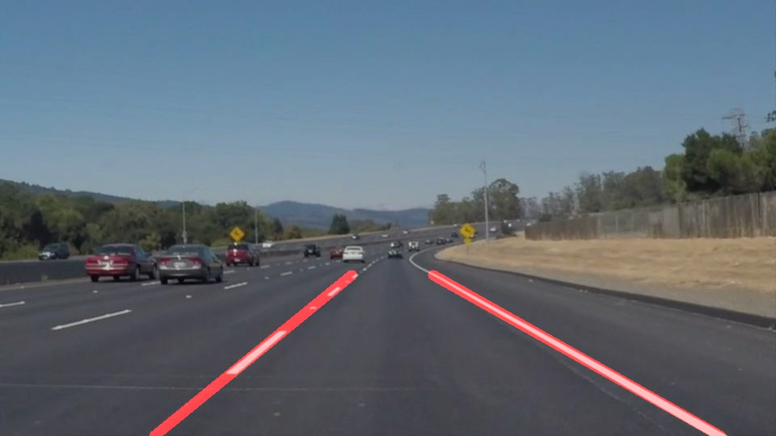

* image 2

 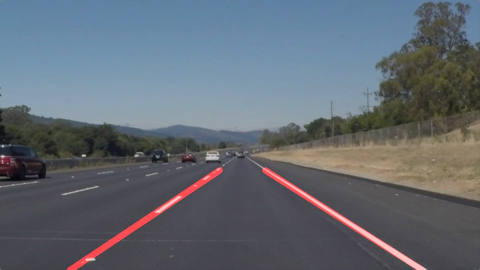

* image 3

 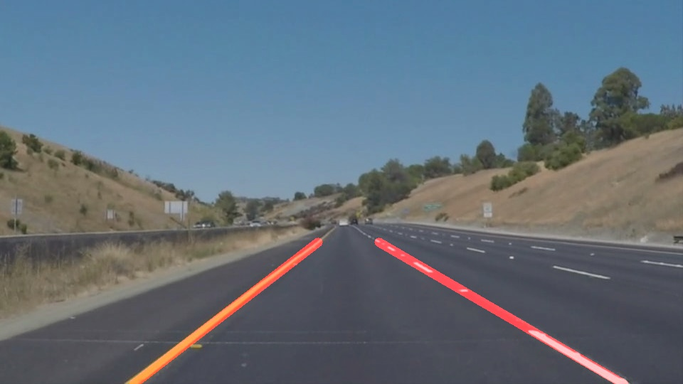

### Videos

Below are some results of the videos (Hover the mouse and click on the link on the right to open the video)

* Video1 :

* Video 2 :

* Video Challenge :

* Personal video :

## shortcomings

My personal video and the  challenge videos highlighted the shortcomming of my pipeline:

* The cv2.fitline function would crash for points outside of certain slope boundaries  : (0.3, 1.0) and (-0.3, -1.0).
  Many videos recorded failed in my pipeline. The camera need to to be stabilized and fix-mounted to have viable videos.

* My pipeline is highly sensitive to color that can be affected by change is atmospheric condition. Thus the use of HSV color space to alleviate this issue.
* My pipeline requires hard coded regions for the selection of region of interest
* Curves are not handle well
* My pipeline depends on lane location,  the position of the camera, the road condition (E.g discolored lane caused by poor maintenance), driving condition (no car ocluding the view of the lanes) and excelent atmospheric condition (nice weather)

## Improvements

* Adjust the parameters of   hough transform and Canny edge detection automatically based on current atmospheric conditions
* Calculate regions of interest on the fy depending on the road topography
* calculate color mask selection on the fly depending on the type of the images.
